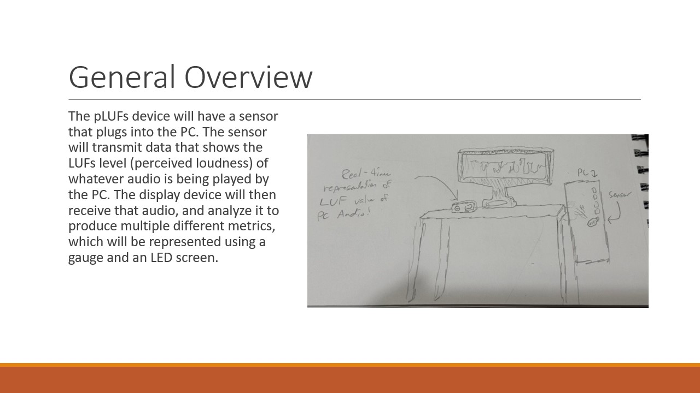
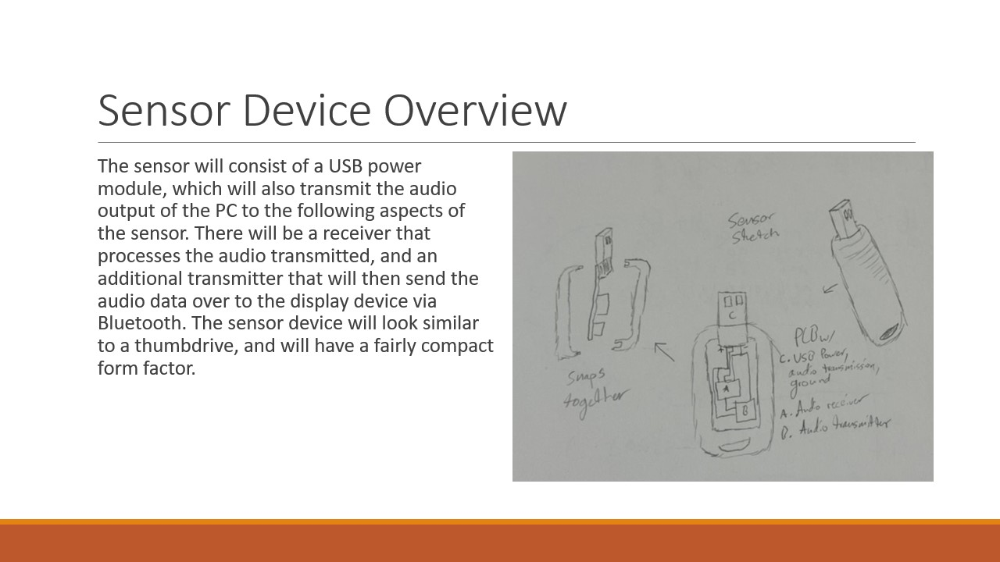
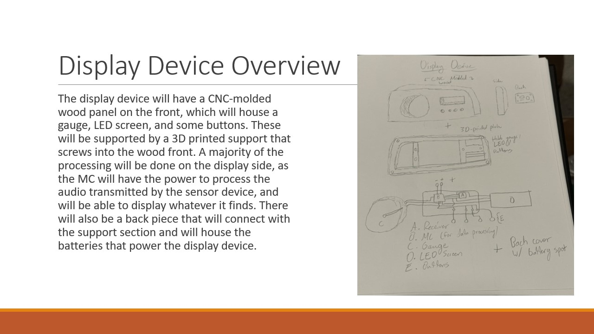
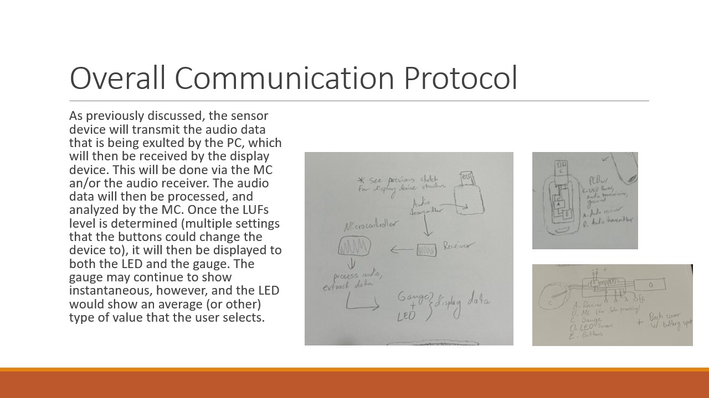

# pLUFs

The Physical LUFS meter will be a project that allows users to have realtime analysis of the LUFs level of the audio being transmitted by their PC. This README has 5 sections:

1. Initial title
2. Overview of Project
3. Sensor Device
4. Display Device
5. Communication Protocol

Here are the slides:

## Slides

### Initial Title

Here's the title of the project: 

Here's an overview of the project:

Here's the sensor device:

Here's the display device:

Here's the overall communication protocol of the device:

